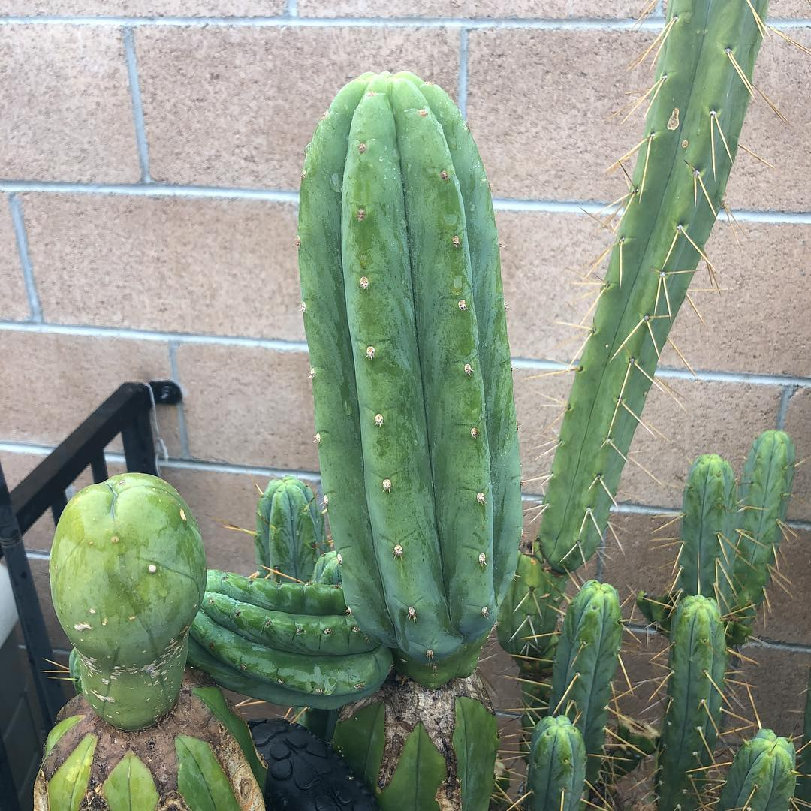

Ogun or Ogunbodede is a classic Pachanoi clone.   

Ogunbodede

<table class="infobox-table">
<tr>
    <th class="parameter-title">Species: </th>
    <td>T. Pachanoi</td>
</tr>
<tr>
    <th class="parameter-title">Source: </th>
    <td>C. Mills</td>
</tr>
<tr>
    <th class="parameter-title" >Location: </th>
    <td>California</td>
</tr>
<tr>
    <th class="parameter-title">Date: </th>
    <td>circa 2005</td>
</tr>
</table>

Aliases

<ul class="infobox-table">
    <li class="alias-name">Ogun</li>
    <li class="alias-name">San Pedro</li>
</ul>

## Origin

The following are excerpts sourced from T. Origins and History and reddit about the origins of Ogun:

<blockquote>
OGUN(bodede) is a Peru clone which remained in a postal parcel for one year before being transplanted and then tested and gave a high concentration of alkaloids (4.5 - 5%). it quickly became the most desired clone for many for this. My opinion is that 5g dry for 250 mg alkaloids is also what some bridgesii give (TBM clone A and B for example, SS02, Kate'bridge....) treated the same way! they are thus used as a powerful insecticide against aphids and are thus a guarantee of resistance to natural elements, what is called here "athleticism". this clone would come from the region of northern peru which has a long shamanic tradition and has been domesticated for one knows how many years, perhaps thousands, reproducing by cuttings and by exchanges between Andean curanderos.      
-<em>K. Touziedje</em>
</blockquote>

<blockquote>
The ogunbodede clone is named after the lead researcher who compiled a chemical analysis study in 2010. According to legend, Ogunbodede sourced many plants for this study, but one box got lost in the mail. That box had two cuttings from a pachanoi in Matucana, Peru. After almost a year MIA, a beat up box arrived with two cuts that had almost mummified during the journey. One was used in the analysis and the data was an outlier more than two standard deviations above the mean. Instead of looking into the variable that caused the discrepancy, they included it in the report as is.

The other cutting was planted, and dispersed throughout the cactus community with the Ogunbodede name. <a href="https://sacredsucculents.com/" target="_blank">Sacred Succulents</a> did most of the original dispersion.

As for looks, it has that smooth Matucana pach vibe. Short spines and a nice green dermis help set it apart from other pachanoi varieties, but it's indistinguishable from other Matucana or landrace pachs.  

-<em>u/boofingcactus</em>
</blockquote>

## Characteristics 

Ogun displays characteristics common to Pachanoi with short spines and green color.

  
  
The Cactus Jones

  <a target="_blank" href="/clones/pachanoi/assets/ogun2.webp">
    
    
u/strange_happenings23

  </a>
 

  <a target="_blank" href="/clones/pachanoi/assets/ogun3.webp">
    
    
u/strange_happenings23

  </a>

<!-- <figure markdown>
  { width="300" }
  <figcaption>Ogun Clone (Picture by Mallacht)</figcaption>
</figure> -->