

For those new to the hobby, identifying the species we lump under San Pedro can be difficult at first, but with some practice (and hours of staring at plants) you will be able to identify them with ease.  

This page will walk you through some tips to identify San Pedro as well as some of the common species mistaken for San Pedro.

## San Pedro
---
What we refer to as "San Pedro" usually consists of four different trichocereus species: 

* [Trichocereus pachanoi](about/pachanoi.md)
* [Trichocereus bridgesii](about/bridgesii.md)
* [Trichocereus peruvianus](about/peru.md)
* [Trichocereus scopulicula](about/scop.md)

While each of these species each have unique identifying characteristics, overall they share similar traits (For species specific traits, go to each species corresponding page for more info).  

First, some basic terminology used when identifying catus can be helpful:

* **Ribs**: are the protruding rows that run vertically from the crown to the base of the cactus. Spines and flowers grow on the edge of these ribs. Cactus ribs help keep the plant cool by creating shaded troughs/pockets between them, and increasing the surface area to dissipate heat. They also allow for contraction and expansion to store water.
* **Areoles**: the small, round bumps that can be light tan to dark brown and grow centrally down the spine. Spines grow in clusters from the areoles and flowers bloom from them. Areoles are modified branches.
* **Spines**: these are the shap needles that grow from the areoles. These are modified leaves evolved for protection.

## Cereus Species
---

The infamous "Peruvian Apple Cactus." This is most commonly mistaken for San Pedro because it's size, profile, color, and flowers look very similar to Trichocereus.

There are several species of Cereus that look almost identical. They usually get lumped into the description of Cereus peruvianus, which is not an accepted species. [(View Article)](https://cactiguide.com/article/?article=article3.php). These include C.repandus, C. jamacaru, C. forbesii, C. hexagonus and C. stenogonus. Other Cereus species are easier to distinguish from Trichocereus.

The main features that distinguish a Cereus from a Trichocereus are the flat skinny ribs, hairless flower tubes, and the branching tree-like structure of mature plants.

  
   
  

<!-- 

  
  
Cereus

  
  
Cereus

  
  
Cereus

 -->

<!-- <figure markdown>
  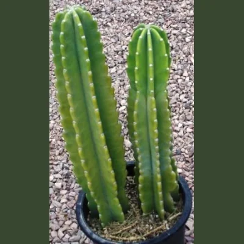{ width="300" align=center }
  <figcaption><h6>Flat and skinny ribs</h6></figcaption>
</figure>

<figure markdown>
  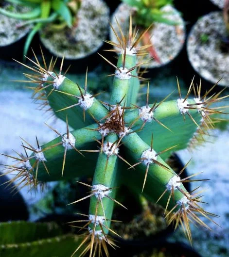{ width="300" align=center }
</figure>

<figure markdown>
  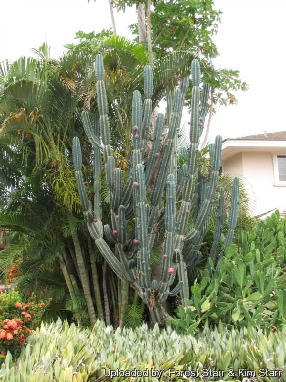{ width="300" align=center }
  <figcaption><h6>Tree-like branching with hairless fruits and flowers</h6></figcaption>
</figure> -->

## Myrtillocactus geometrizans
---

This cactus goes by many names including the blue candle, whortleberry, bilberry, blue myrtle...

This plant often has a deep blue farina, but larger plants usually look light green. Young plants are columnar and usually have 5-6 angular ribs. The ribs are often thicker than a Cereus and narrower than Trichocereus. Mature plants can get large, but are more shrub-like than tree-like. 

The best way to distinguish these plants from Trichocereus is to look at the spines. Myrtillos have a few short spines per areole. The spines on short plants are usually dark colored and pyramidal (instead of round, needle-like spines.) Spine length increases as the plants age, but the spines stay angular.  

  
   
  

<!-- 

  
   
   

<figure markdown>
  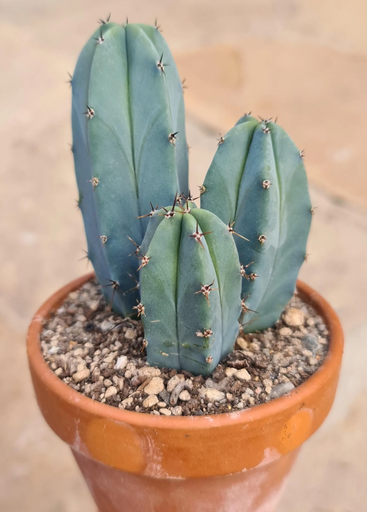{ width="300" align=center }
  <figcaption><h6>Blue farina with short, dark, pyramidal spines</h6></figcaption>
</figure>

<figure markdown>
  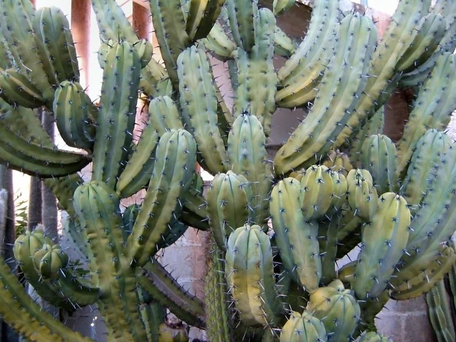{ width="300" align=center }
  <figcaption><h6>Mature plants are shrub-like. Spines get longer and lighter.</h6></figcaption>
</figure> -->

## Stetsonia coryne
---

This is the toothpick cactus. It looks very similar to Trichocereus species like T. peruvianus, T. knuthianus, etc. However, there are a few subtle ways to distinguish a Toothpick cactus from a Trichocereus.

The dermis of a Stetsonia will be a darker green in healthy plants. The aeroles are large, white, woolen and not perfectly circular.

The easiest way to distinguish a Toothpick cactus is of course, by the spines. Stetsonias will have one long spine per areole that resembles a toothpick. The coloration of new spines will usually be yellow, black, and brown. They lose their color and turn grey to white rather quickly. Usually only the top few areoles will have the colorful spines. 

  
   

<!-- <figure markdown>
  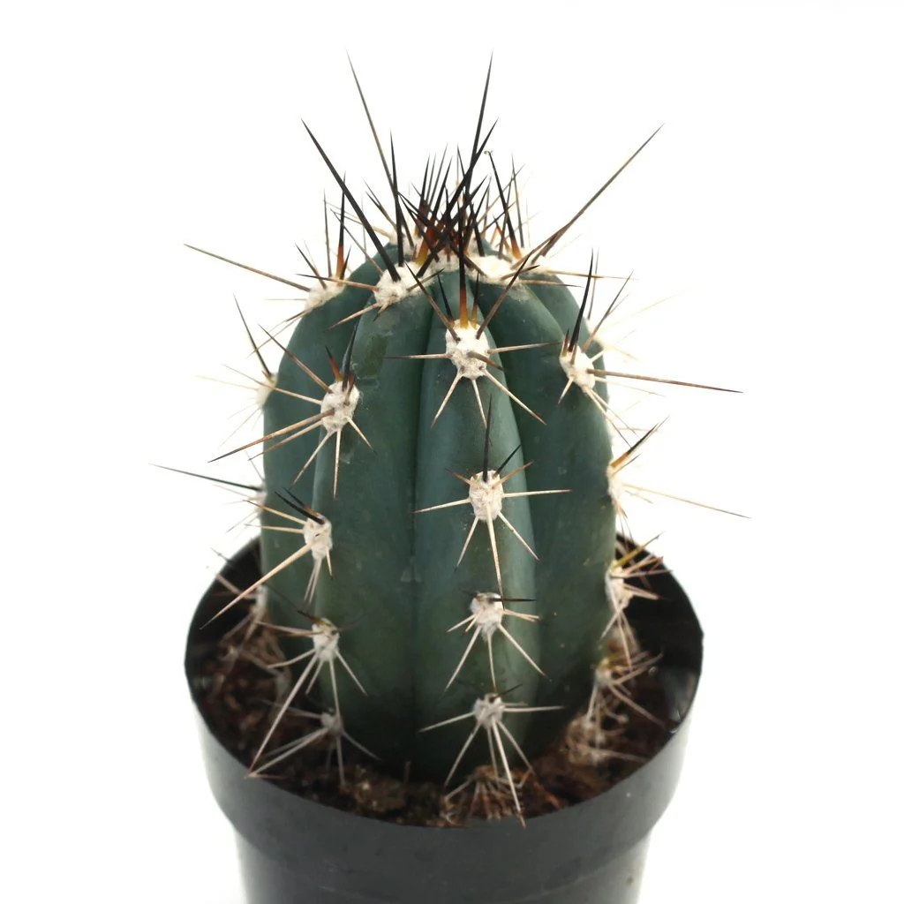{ width="300" align="center" }
  <figcaption><h6>Large, woolen, and ovoid areoles. Dark green dermis is common on youngsters.</h6></figcaption>
</figure>

<figure markdown>
  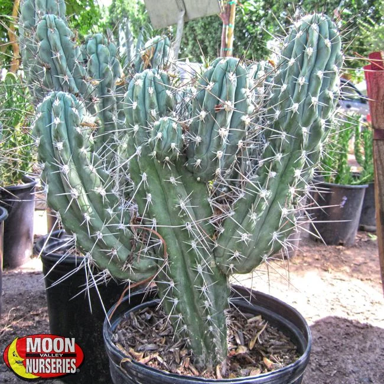{ width="300" }
  <figcaption><h6>Mature plants have tree-like branching and get very large.</h6></figcaption>
</figure> -->

## Pilosocereus species 
---

There are many species in the Pilosocereus genus, but just a few closely resemble San Pedros. Most Pilosocereus will be very blue, with needle-like spines that are yellow to grey. The most common, and most commonly mistaken for San Pedro is P. pachyclaudus. Other Pilos are much more uncommon, or have features like long hairs that make them easy to distinguish from a San Pedro. 

Young P. Pachyclaudus will usually have a vibrant blue skin with bright yellow spines. This should make them easy to pick out of a lineup. Unhealthy plants will have lost their blue farina. For these plants look at the areoles and spines for ID. There should be about 10 yellow, spines that are evenly fanned out within the areole. The spines are also very fine, much thinner than most Trichocereus species. 

  
   

<!-- <figure markdown>
  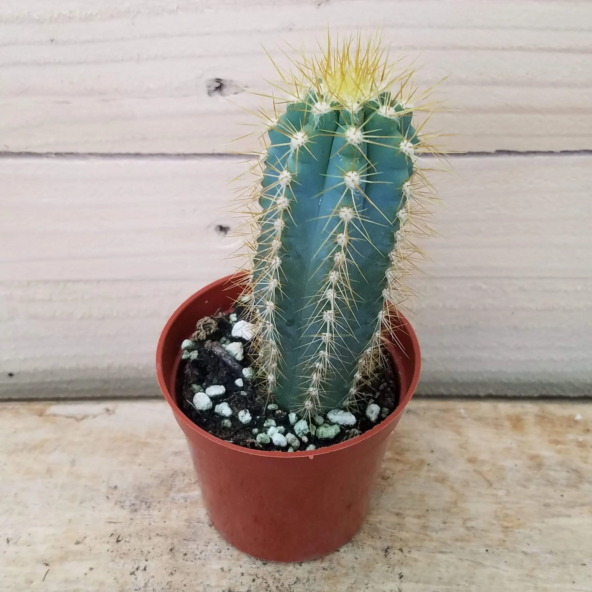{ width="300" }
  <figcaption><h6>Bright blue skin, yellow spines are thin.</h6></figcaption>
</figure>

<figure markdown>
  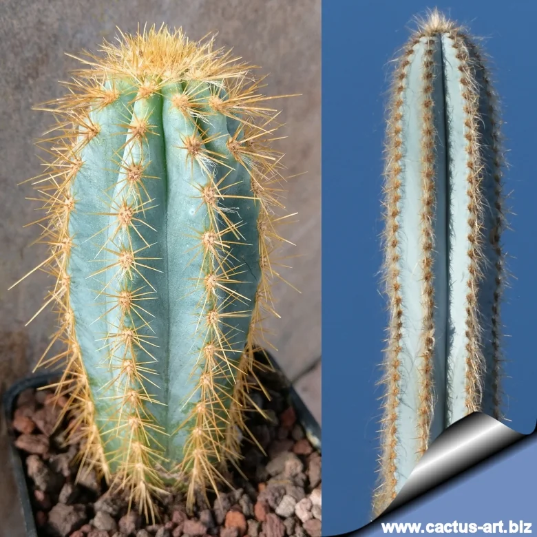{ width="300" }
  <figcaption><h6>Hairy aerolas are common for mature Pilos.</h6></figcaption>
</figure> -->

## Lophocereus / Pachycereus species
---

Pachycereus got merged into the Lophocereus genus this year!? Wacky, but they still get confused with San Pedros so here are the common ones. 

L. Marginatus is the Mexican Fence Post cactus. The size and profile are very similar to San Pedro. The easiest way to distinguish a fence post is by their unique vertical stripes. I stead of separate areoles, you will notice white stripes that run the length of the plant. Unhealthy plants will lose the white wool, but upon a close inspection, you can see the line of spines. The flowers are also small and more similar to Pilosocereus flowers.

  
   

<!-- <figure markdown>
  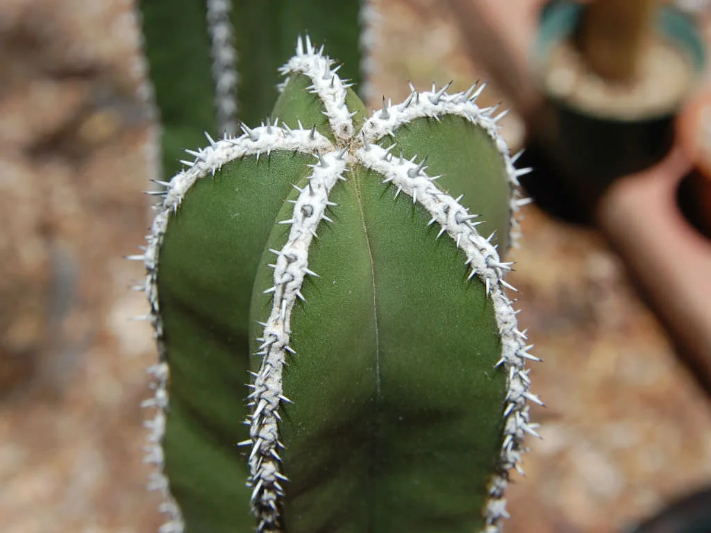{ width="300" }
  <figcaption><h6>Elongated areoles form vertical white stripes.
</h6></figcaption>
</figure>

<figure markdown>
  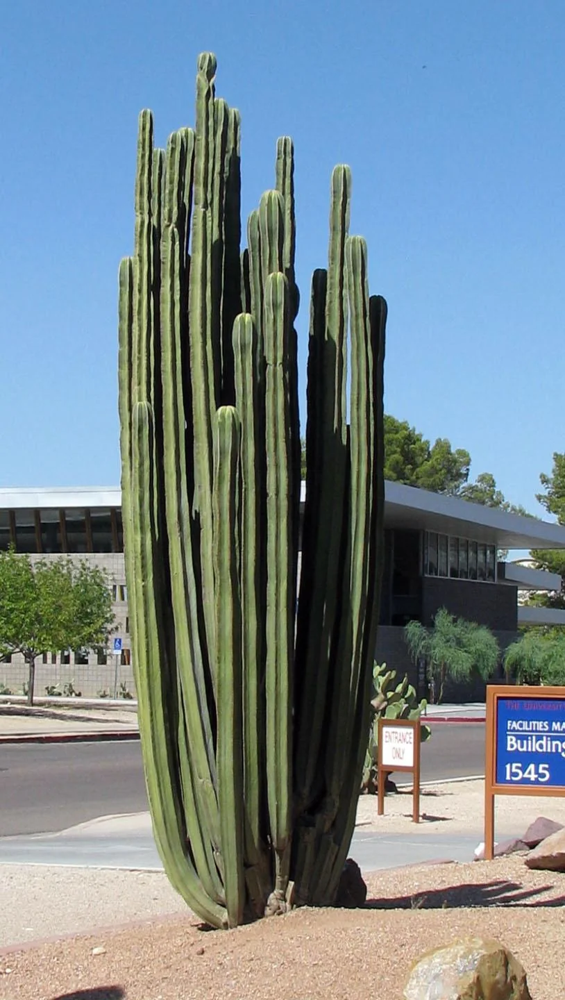{ width="300" align=center }
  <figcaption><h6>Truly columnar, branching at the base. The fence post cactus.
</h6></figcaption>
</figure> -->

L. Schottii is another common columnar. Especially in the Phoenix metro area, you will drive past hundreds of the monstrose form. The totem pole cactus slightly resembles a monstrose Trichocereus. The exaggerated lumpiness and absence of descernable ribs or areoles makes a totem pole pretty easy to spot. 

  

<!-- <figure markdown>
  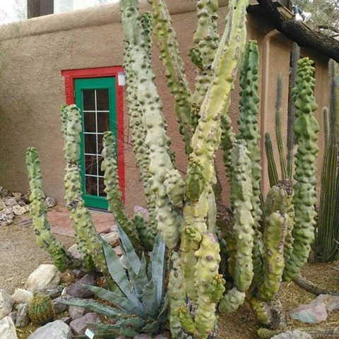{ width="300" }
  <figcaption><h6>It is super common to see large stands of the Totem Pole Cactus in Pheonix.
</h6></figcaption>
</figure> -->

<!-- Solarized dark             |  Solarized Ocean
:-------------------------:|:-------------------------:
  |  

  
   
  

 -->

The non-monstrose form of L. schottii is actually less common. Adults look similar to an extra spiny Cereus or L. marginatus. Juveniles look more like the juvenile Polaskia and Stenocereus species.

## Stenocereus and Polaskia species
---
Polaskia chichipe can look very similar to San Pedros. The best way to discern a polaskia is by the ribs and spines. The ribs will be thinner and more acute than Trichocereus, but wider than Cereus. They usually have 6-8 evenly spaced radial spines, and one long central spine. Although the spination is similar to T. peruvianus, the central spine of a Polaskia will be more oval shaped instead of needle-like. Adult plants usually branch freely from higher up. Juvenile plants often have a grey, striped farina that disappears with age. This makes them hard to discern between Stenocereus and Lophocereus juveniles, but it is easy to tell it apart from a Trichocereus.  

  
   
   

## Browningia hertlingiana
---
Brownies are beautiful blue plants that can look similar to Trichocereus peruvianus or cuzcoensis. The ribs are the defining traits to look at here. The ribs of a Browningia are wavy instead of straight. Mature plants will often have more than 8 ribs, which would be uncommon for most Trichocereus species. 

  
   

><h6>*Most of this guide has been adapted from [Reddit](https://www.reddit.com/r/sanpedrocactus/comments/pk2cvv/is_this_san_pedro_the_mega_sticky_for_san_pedro/){:target="_blank"} by user u/BoofingCactus</h6>