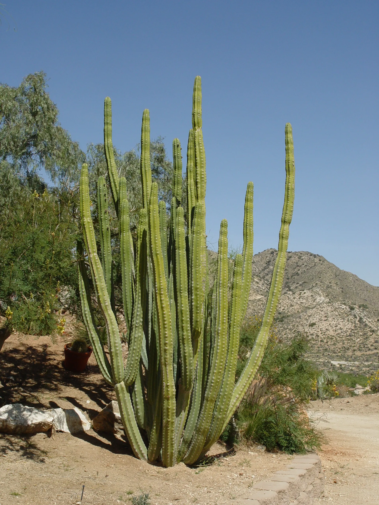

<!-- # Welcome to Trichopedia! -->
<h1 style="text-align: center;">Welcome to Trichopedia!</h1>

<figure markdown>
  { width="300" }
  <figcaption>Trichocerus Pachanoi</figcaption>
</figure>

<!-- { align=right width="300" } -->

This site is meant to serve as a resource of all info Trichocereus (San Pedro) related including: 

* [About](about/about.md) - Background info on all species under the umbrella "San Pedro"
* [Identification](identify.md) - How to identify trichocereus plants
* [Guides](grow-guides/seed.md) - How to grow trichocereus from seeds and cuttings
* [Clone List](clones/index.md) - An encylopedia of popular cultivars and their origins

### Additional Info

---

> :boom:
Title title like above is optional

---

>*<h6>The information on this site is for educational purposes only.*  
>*Information has been gathered from a variety of sources.*  
>*If you see your picture/info has been used and you wish*  
>*to add credit or be removed, please contact at:*  
>*trichopedia@gmail.com</h6>*
